# Software Engineering Complete

#### A dedicated handbook on the whole development process of a software engineering project

_Based on [textbook](https://nus-cs2103.github.io/website/book/common/print.html) of CS2103T Software Engineering_ 
_Correct as AY2017/2018 Semester 1_ 
_School of Computing, National University of Singapore_

## Introduction

According to _IEEE Standard Glossary of Software Engineering Terminology_, software Engineering is the application of a systematic, disciplined, quantifiable approach to the development, operation, and maintenance of software.

According to _The Mythical Man-Month_, software engineering (or programming) is fun because:
- The sheer joy of making things;
- The pleasure of making things that are useful to other people;
- The fascination of fashioning complex puzzle-like objects of interlocking moving parts and watching them work in subtle cycles, playing out the consequences of principles built in from the beginning;
- The joy of always learning, which springs from the nonrepeating nature of the task;
- The delight of working in such a tractable medium.

Frederick P. Brooks also stated in his book, software engineering may not be fun because:
- One must perform perfectly;
- Other people set one's objectives, provide one's resources, and furnish one's information;
- The dependence upon others;
- Finding nitty little bugs is just tedious work;
- The last difficult bugs taking more time to find than the first;
- The product over which one has labored so long appears to be obsolete upon (or before) completion.

A software project may be either: 
- a _brown-field_ project: develop a product to replace/update an existing software product; or
- a _green-field_ project: develop a totally new system with no precedent.

## Requirements

A **software requirement** specifies a need to be fulfilled by the software product. Requirements come from stakeholders (a party that is potentially affected by the software project, usually users).

There are two types of software requirements:
- Functional requirements: specify what the system should do;
- Non-functional requirements (NFR): specify the constraints under which system is developed and operated, such as availability, budget constraint, capacity, compatibility, performance, portability, robustness, security, stability, testability.

### Gathering requirements

- Brainstorming: a group activity designed to generate many diverse and creative ideas, at which there are no "bad" ideas;
- User survey: to solicit responses and opinions from a large number of stakeholders;
- Observation: uncover product requirements by observing users in their natural work environment;
- Interview: interviewing stakeholders and domain experts;
- Focus group: a kind of informal interview within an interactive group setting;
- Prototyping: to create a mock-up, scaled-down version, or a partial system to see how users interact with the system;
- Product survey: to study existing products in the market.

### Specifying requirements

- Prose: a normal textual description to describe requirements, usually used as "_vision_";
- Feature list: a list of features of a product grouped according to some criteria such as aspect, priority;
- User story: a short, simple description of a feature (_both functional and NFRs_) told from the user's perspective, in the format of `As a {user type/role} I can {function} so that {benefit}`, where high-level user stories are called **epics**;
- Use case: to describe an interaction between the user (called "_actor_") and the system for a specific functionality of the system, which consists of a sequence of actions.
	- A use case describes only the externally visible behaviour, not internal details, of a system;
	- A use case can have main success scenario (MSS) and extensions;
	- A use case can include another use case or use another use case as extension.

### Glossary

A glossary serves to ensure that all stakeholders have a common understanding of the noteworthy terms, abbreviation, acronyms, etc.

## Design

Design is the creative process of transforming the problem into a solution; the solution is also called design. There are two types of design in software engineering:
- Product/external design: designing the external behaviour of the product to meet the users' requirements;
- Implementation/internal design: designing how the product will be implemented to meet the required external behaviour.

In a large software engineering project, design should be done at multiple levels. This can be done in a top-down manner, bottom-up manner or a mix.

Apart from an overall design, sometimes **agile design** is also important but it is different in the following ways: agile designs are emergent, they're not defined up front. Although you will often do some initial architectural modeling at the very beginning of a project, that will be just barely enough to get your team going.

### Design principles

- Abstraction: _data abstraction_ ignores lower level data items and thinking in terms of bigger entities, while _control abstraction_ abstracts away details of the actual control flow to focus on tasks at a simplified level;
- Coupling: a measure of the degree of dependence between components, classes, methods, etc. `X is coupled to Y` if a change to Y can potentially require a change in X. High coupling is discouraged since maintenance, integration and testing will be harder. Thus, we should **reduce coupling**, or so-called **de-couple**.
- Cohesion: a measure of how strongly-related and focused the various responsibilities of a component are. Weak cohesion will lead to difficulty in understandability, maintainability and reusability of the module. Thus, we should **improve cohesion**.
- **Open-closed Principle (OCP)**: _A module should be open for extension but closed for modification. That is, modules should be written so that they can be extended, without requiring them to be modified._
- **Dependency Inversion Principle** states that
	- High-level modules should not depend on low-level modules. Both should depend on abstractions;
	- Abstractions should not depend on details. Details should depend on abstractions.

### Object-oriented programming

- A programming paradigm guides programmers to analyze programming problems and structure programming solutions in a specific way. A few popular paradigm includes procedural programming (_C_), functional programming (_JavaScript and Haskel_) and object-oriented programming (_Java_);
- OOP views the world as a network of interacting objects. OOP solutions try to simulate such a network inside the computer's memory, although no need to follow the real world exactly;
- Object ultimately achieves three goals:
	- Encapsulation: to encapsulate both state (data) and behaviour (operations on data);
	- Abstraction: to abstract away the lower level details and work with bigger granularity entities;
	- Information hiding: state and behaviour only accessible via the interface;
	- Message passing: to interact with each other by sending messages.
- A class contains instructions for creating a specific kind of objects;
	- Class level members: variables or methods that are shared by all instances of a class, which are accessed via class name;
	- Enumeration: a fixed set of values that can be considered as a data type.

#### Class relationship

- Association: connections between objects or classes, may change over time;
	- Navigability: to decide which party knows the other class, usually identical to in which class the associated field is defined;
	- Multiplicity: to decide for each party how many objects take part in the association;
	- Association class: a normal class but plays the role of association in the network.
- Dependency: a weaker form of association, not directly linked in the network but still can interact with each other;
- Composition: to represent a strong **_whole-part_** relationship. When the _whole_ is destroyed, _parts_ are destroyed too;
- Aggregation: a weaker form of composition, to represent a **_container-contained_** relationship.

#### Class inheritance

- Inheritance allows you to define a new class based on an existing class. A super class should be more general than the subclass. The subclass can be considered as a sub-type of the super class, resulting in a `is a` relationship.
- Multiple inheritance allows one class to inherit directly from multiple classes. Java forbids this while C++ allows this.
- **Overriding**: change the behaviour of the superclass method by re-implementing it.
	- Method overriding cannot change the type signature, return type or the thrown exception.
	- The level of access can be changed, but cannot be lower than the access modifier in superclass method.
	- `final` methods cannot be overriden.
	- Constructor cannot be overriden.
	- `static` methods cannot be overriden, but can be re-declared.
- **Overloading**: there are multiple methods with the same name but different type signature.
	- Type signature: including the number, order and type of the formal parameters.
	- Return type is not part of the type signature.
- An interface is a collection of behaviour specification, resulting in a `is a` relationship. A class implements an interface to support all its behaviour.
	- Interface does not have constructor and thus cannot be instantiated.
	- All methods in an interface is implicitly `public abstract` (unless it is a `public default` method).
	- All attributes in an interface is implicitly `public static final`.
	- An interface can inherit from multiple interfaces.
- An abstract class is a class declared as `abstract`, which may or may not contain abstract methods.
	- Abstract class cannot be directly instantiated.
	- Constructor and `static` method cannot be declared as `abstract`.
	- Abstract class can be inherited from, but their subclasses must implement all abstract methods (unless they are also abstract).
- Static binding happens at the compile time, while dynamic binding happens at the runtime.
	- Method overriding is resolved at the runtime.
	- Method overloading is resolved at the compile time.
- Substitutability: every instance of a subclass must also be an instance of its super class (or interface), but not vice-versa.
- **Polymorphism**: polymorphism is achieved thanks to **_substitutability_**, **_method overriding_**, and **_dynamic binding_**.

### Design pattern

- **Design pattern**: an elegant reusable solution to a commonly recurring problem within a given context in software design.
- Singleton: some certain classes should have no more than just one instance.
- Abstraction occurence: if a group of entities appears to share some common information, use an `<<abstraction>>` class to hold all common information, use an `<<occurrence>>` or `<<copy>>` class to hold individual information.
- Facade: if external classes need to access information deep inside one component, include a **Facade** class to settle all these interactions.
- Command: use a generic `<<Command>>` class (can be abstract class or interface) to pass around and accomplish different tasks.
- Model-view-controller (MVC): the ultimate goal of an application is to present data to users in an elegant way, MVC helps programmers to achieve that.
- Observer: to make sure the observer get notified when the observed object gets changed.

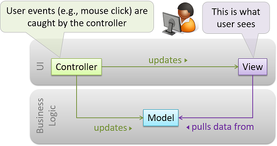

## Implementation

- Integrated development environments (IDE): a source code editor, compiler/interpreter, debugger, etc.
- Debugging: the process of discovering defects in the program, can either
	- By inserting temporary print statements;
	- By manually tracing through the code;
	- Using a debugger (**recommended**).

### Code quality

- To maximize understandability.
	- Always use curly braces to show grouping;
	- Use enumeration when the value of a variable can only take a fixed set of values;
	- Structure code logically and put statements/methods in the suitable order;
	- Never write _clever_ code, keep it simple and stupid (**KISS**);
	- Adopt _single level of abstraction per method_ (**SLAP**);
	- Avoid long method;
	- Avoid deep nesting (in `if-else` statement or loop);
	- Avoid complicated expression (lengthy boolean expression);
	- Avoid magic number (use a named constant instead);
	- Avoid implicit type conversion/casting;
	- Avoid premature optimization.
- To follow a strict coding standard (_aka style guide_), to make the entire codebase looks like it was written by one person.
- To adopt a good naming convention.
	- Use nouns for class/object/attribute names and verbs for methods;
	- Distinguish clearly between singular and plural form;
	- Use standard English word.
	- Related things should be named similarly, while unrelated things should NOT.
- To avoid unsafe shortcut.
	- Always include a default branch in the `case` statement;
	- Always include the last `else` clause in the `if-else if` statement;
	- Use one variable for one purpose. Do NOT re-use or recycle them;
	- Avoid empty or duplicate `catch` block;
	- Get rid of unused or unreachable code;
	- Define variables in the least possible scope.
- Comment minimally but sufficiently
	- No need to write comments if the code is self-explanatory;
	- Explain what and why aspect of the code, rather than the how aspect;
	- Starts the sentence with a verb in singular form.

### Refactoring

Refactoring is a process that improves a program's internal structure in small steps without modifying its external behavior. It is different from code rewriting or debugging. It may reveal hidden bugs and improve performance, sometimes.

Given below are some common refactoring:

- Consolidate duplicate conditional fragments (extract common part from `if` and `else` clause);
- Extract method (group statements together);
- Decompose conditional (use extracted method in condition that the `if-else` statement is too complicated);
- Inline method (remove the method and put its body into the caller);
- Remove double negative;
- Replace magic number with symbolic constant;
- Replace nested conditional with guard clauses (separate `if` clauses);
- Replace controlling parameters with separate methods;
- Split the loop (one loop should only do one thing);
- Split temporary variables (one variable should only have one purpose).

### Documentation

- There are two types of developer-to-developer documentation, developer-as-user (API documentation) or developer-as-maintainer.
- Documentation should be written in a top-down breadth-first approach.
- Documentation should aim for not only comprehensiveness, but also **comprehensibility**.
	- Use plenty of diagrams and examples to make sure readers can understand what you write down.
- Document minimally but sufficiently.
	- Anything that is already clear in the code need not be described in words.

### Error handling

- Exception: used to deal with "_unusual_" but not entirely unexpected situations that the program might encounter at runtime.
	- Exception objects can propagate up the method call hierarchy until it is dealt with.
	- Use `try-catch` block to seperate normal workflow and error handling workflow.
- Assertion: used to define assumptions about the program state so that the runtime can verify them.
	- An assertion failure usually indicates a potnetial bug in the code.
	- Java disables assertion by default, you can use `java -enableassertions <ClassName>` to enable it.
- Logging: the deliberate recording of certain information during a program execution for future reference, which would be useful for troubleshooting.
	- A log file is like the black box of an airplane; they don't prevent problems but they can be helpful in understanding what went wrong after the fact.
- Defensive programming: if we leave room for things to go wrong, they will go wrong. Given below are some common defensive programming practices:
	- Enforcing compulsory associations (check for `requireNotNull`);
	- Enforcing 1-to-1 associations;
	- Enforcing referential integrity (similar to the concept of foreign key constraint);

### Integration

- Integration is the process of combining parts of a software product to form a whole.
	- Integration is usually the most troublesome task.
- _Early and frequent_ is better: integrate early and evolve each part in parallel, in small steps, re-integrating frequently.
- _Incremental integration_ is better: integrate few components at a time.
- _Top-down integration_, _bottom-up integration_ and _sandwich integration_ are all necessary.

### Build automation

- Build automation tools automate the steps of the build process, usually by means of build scripts.
- Some popular Java build tools: gradle, maven, ant, make.
- Some build tools also serve as dependency management tool, like gradle and maven.

### CI/CD

- Continuous integration (CI): integration, building, and testing all happens automatically after each code change.
- Continuous deployment (CD): the changes are not only integrated continuously, but also deployed to end-users at the same time.
- Some popular CI/CD tools: Travis CI, Circle CI, AppVeyor, Jenkins.

### Reuse

- Application programming interface (API): specifies the interface through which other programs can interact with a software component.
- Library: a collection of modular code that is general and can be used by other programs.
	- Java classes inside the SDK (like `String`, `HashMap`) and external library (like `Natty`).
- Framework: a reusable implementation of a software (or part thereof) providing generic functionality that can be selectively customized to produce a specific application.
	- Eclipse - an IDE framework, JavaFX - a GUI framework, JUnit - a test framework, Drupal and Ruby on Rails - popular Web frameworks.
	- Framework uses _inverse of control_, programmers write code to be called by the framework.
- Platform: provides a runtime environment for applications
	- Technically, an operating system can also be called a platform.
	- JavaEE and .NET are two popular platforms used for enterprise systems.

## Quality assurance

- Software Quality Assurance (QA) is the process of ensuring that the software being built has the required levels of quality.
	- Quality Assurance = Validation + Verification
- Validation: are we building the right system i.e., are the requirements correct?
- Verification: are we building the system right i.e., are the requirements implemented correctly?

### Code review

- Code review is the systematic examination of code with the intention of finding where the code can be improved.
- Popular forms of code review: pair programming, pull request review, formal inspection.

### Static analysis

- Static analysis is the analysis of code without actually executing the code.
- Linters are a subset of static analyzers for code quality.
- Some popular Java static analyzer: CheckStyle, PMD, FindBugs.

### Formal verification

- Formal verification can be used to prove the absence of errors, while all other forms of QA cannot.
- Formal verification is more commonly used in safety-critical software such as flight control systems.

### Testing

- Testing is operating a system or component under specified conditions, observing or recording the results, and making an evaluation of some aspect of the system or component.
- A test case failure is a mismatch between the expected behavior and the actual behavior. A failure is caused by a defect (or a bug).
- Testability is an indication of how easy it is to test an SUT.
- Different types of testing: unit testing, integration testing, system testing, acceptance testing (UAT).
	- **_Stub_** is used in unit testing to isolate the unit under test from other components. A stub has the same interface as the component it replaces, but its implementation is so simple that it is unlikely to have any bugs.
	- System test cases are based on the specified external behavior of the system, which may include NFRs.
	- Acceptance testing focus more on positive test cases, while system testing focus on both positive and negative test cases.
- A mix of _scripted testing_ and _exploratory testing_ is better.
- Any modification may result in some unintended and undesirable effects on the system. Thus, all changes to the codebase must be accompanied with regression testing.
- **_Test coverage_** is a metric used to measure the extent to which testing exercises the code.
	- Different types of coverage: function/method coverage, statement coverage, decision/branch coverage, condition coverage, path coverage, entry/exit coverage.
- **_Dependency injection_** is the process of 'injecting' objects (such as _stub_) to replace current dependencies with a different object.
	- Polymorphism can be used to implement dependency injection.

#### Test case design

- Test case design tries to make sure every test case is effective and efficient (_E&E_).
- Two types of test cases: positive test case & negative test case.
- Three testing approaches: black-box approach, white-box approach, gray-box approach.
- Equivalence partition: a group of test inputs that are likely to be processed by the SUT in the same way.
- Boundary Value Analysis (BVA) is test case design heuristic that is based on the observation that bugs often result from incorrect handling of boundaries of equivalence partitions.
- Test input combination: **_each valid input at least once in a positive test case, no more than one invalid input in a test case_**.

## Project management

### Revision control software

- Revision control software (RCS) utomate the process of managing revisions of software artifacts.
- Some terms for **_Git_**: ignore, commit, stage, history, tag, diff, checkout.
- Some terms for remote repository: pull, push, fetch, clone, fork, pull request, upstream.
- Some terms for branching: branch, merge, merge conflict, fast-forward.

### Project planning

- A Work Breakdown Structure (WBS) depicts information about tasks and their details in terms of subtasks.
- A milestone is the end of a stage which indicates a significant progress.
- A buffer is a time set aside to absorb any unforeseen delays.
- Issue trackers (sometimes called bug trackers) are commonly used to track task assignment and progress.
- Different team structures: egoless team, chief programmer team, strict hierarchy team.

### Software Development Life Cycle

- Sequential model: also called the waterfall model, model software development as a linear process.
- Iterative model: also called the incremental model, advocate having several iterations of SDLC, either breadth-first, depth-first or a mix.
- Agile model: extreme programming (XP), SCRUM (_sprints_), unified process, capability maturity model integration (CMMI).

## UML diagram

UML stands for unified modelling language. It is a general-purpose, developmental, modeling language in the field of software engineering, that is intended to provide a standard way to visualize the design of a system.

UML was originally motivated by the desire to standardize the disparate notational systems and approaches to software design developed by Grady Booch, Ivar Jacobson and James Rumbaugh at Rational Software in 1994-1995, with further development led by them through 1996.

### Architecture diagram

- Software architecture shows the overall organization of the system and can be viewed as a very high-level design.
- There are various architectural styles, like N-tier style, client-server style, transaction processing style, service-oriented style, event-driven style, P2P style, message-oriented style.

The diagram below shows the architecture diagram of [TEAMMATES](http://teammatesv4.appspot.com/):

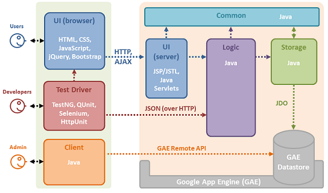

### Class diagram

UML class diagrams describe the structure (but not the behaviour) of an OOP solution. It is probably the most commonly used UML diagram among OOP programmers.

- Use a rectangle to represent a class, which will be divided into three parts vertically, used to write class name, attributes and methods, respectively;
	- However, you can _omit_ the 2nd compartment for attributes and the 3rd compartment for methods.
- Use visibility symbol before attributes and methods to indicate the level of access.
	- `+` stands for `public`, `-` stands for `private`, `#` stands for `protected`, `~` stands for `package private` (default);
	- However, you can _omit_ these visibility symbols.

The diagram below shows the two basic rules above:

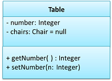

- Use a solid line for **association** between two classes;
- Use the arrow head to indication the navigability of an association;
	- _Notice_: Navigability can be shown in class diagrams as well as object diagrams.
- Use association roles at both ends of the solid line to indicate the role played by both parties in the association;
- Use association label at the middle of the sold line to describe the meaning of the association;
- Use numbers to indicate at both ends of the sold line to indicate the multiplicity of both parties in the association;
	- `0..1` stands for `optional`, `1` stands for `compulsory`, `*` stands for `infinite`, `m..n` stands for the range `[m, n]` (both inclusive).

The diagram below shows how to draw association in the class diagram:

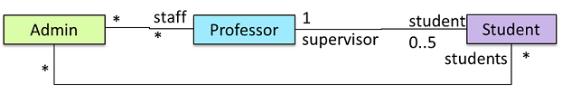

The diagram below shows how to draw association as an attribute in the class diagram:

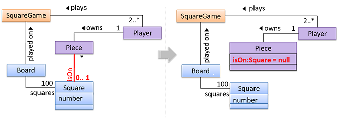

The diagram below shows how to draw an association class in the class diagram:

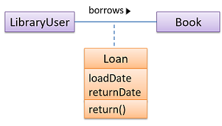

- Composition: use a solid diamond symbol to represent composition.
- Aggregation: use a hollow diamond symbol to represent aggregation.

 &nbsp; &nbsp; &nbsp;
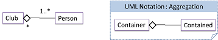

- Class-level members: use underline to denote class-level attributes and methods.

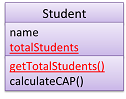

- Inheritance: use a triangle and solid line (not to be confused with an arrow) to indicate class inheritance.

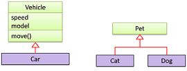

- Interface: use `<<interface>>` to show an interface, use a triangle and a dashed line to indicate implementation.

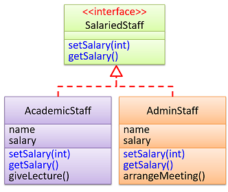

- Abstract class: use _italics_ or `{abstract}` to indicate a class is an abstract class.

- Enumeration: can be considered as a special kind of classes and should be explicitly labelled with `<<enumeration>>`.

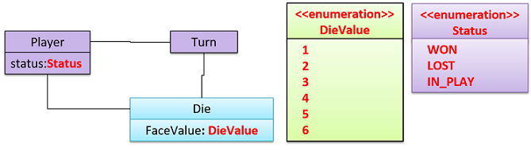

### Conceptual class diagram

- Class diagrams that are used to model the problem domain are called conceptual class diagrams or OO domain models (OODMs).
- OODMs do not contain solution-specific classes.
- OODM notation is similar to class diagram notation but typically _omit methods and navigability_.

Below is an example of conceptual class diagram for snake-and-ladder game:

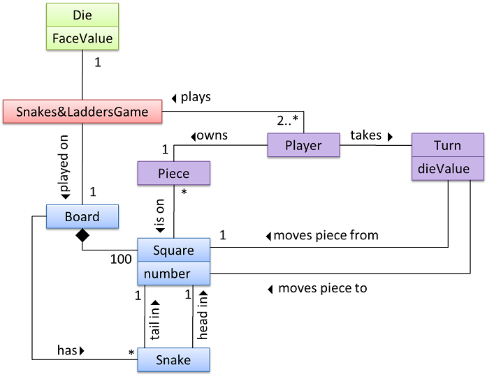

### Object diagram

- An object diagram shows an object structure at a given point of time.
	- `objectName:ClassName` is meant to say _an instance of `ClassName` identified as `objectName`_.
- Use a rectangle to represent an object, which will be divided into two parts vertically, used to write object name and attributes, respectively;
	- However, you can _omit_ the 2nd compartment for attributes.

Below is a simple example of the object diagram:

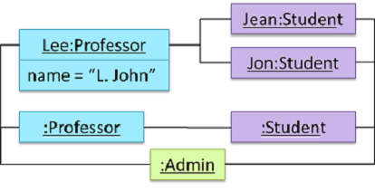

### Sequence diagram

- A UML sequence diagram captures the interactions between multiple objects for a given scenario.
- Use a vertical dashed line as _life line_ to indicate the period of which the instance is alive.
	- The left most life line is reserved for the entities or the actor, usually the driver class or the `main` class.
	- Use a `x` at the end of the life line to indicate object deletion.
- Use a rectangle at the top of each life line to indicate each instance.
	- `objectName:ClassName` is _not_ underlined in sequence diagram.
- Use small rectangle on life line as _activation bar_ to indicate the period of a method execution.
	- The vertically first activation bar may be the constructor method, which is connected to the top rectangle used to represent the instance.
- Use solid arrow to represent method call, while use dashed arrow to represent return value.
	- Dashed arrow may be omitted (sometimes there may be no return value at all).
	- Constructor method call should point to the top rectangle used to represent the instance.
- Use a large rectangle with `alt`, `opt`, `par` or `ref` to represent alternative path, optional path, parallel path or reference frame.

The sequence diagram below illustrates these basic rules:

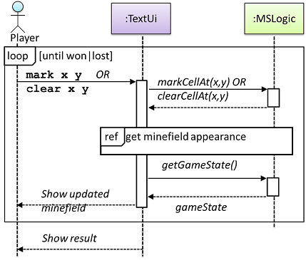 &nbsp; &nbsp; &nbsp;
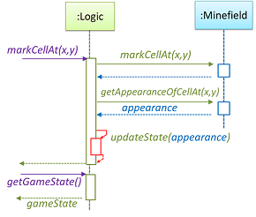

### Activity diagram

- A UML Activity diagram (AD) can model workflows.
- Use a rectangle with rounded edges to represent a single step in an activity.
- Use an arrow to connect two steps (two rectangles) to show the control flow.
- Use a hollow diamond symbol as branch/merge node to represent alternative paths.
	- Only one of the alternative paths can be taken at any time.
- Use a bar as folk/join to represent parallel paths (concurrent workflow)
	- All parallel paths should be complete before the execution can start on the outgoing control flow of the join.
- Use a rake symbol to represent the part that will be shown in a separate activity diagram.
- Use vertical dashed line as _swimline_ to partition an activity diagram to show who is doing what.

The activity diagram below illustrates these rules:

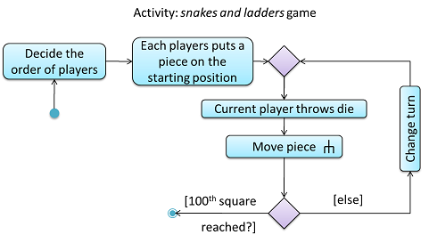 &nbsp; &nbsp; &nbsp;
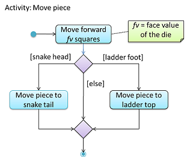

### Use case diagram

- Use a dashed line with `<<extend>>` to show **extension**;
	- Note the direction of the dashed line is from the extension to the use case it extends.
- Use a dotted arrow with `<<include>>` to show **inclusion**;
	- Note how the arrow direction is different from the `<<extend>>` arrows.
- Use the notation for inheritance in class diagram to show **actor generalization**.

The diagram below shows how to draw a use case diagram:

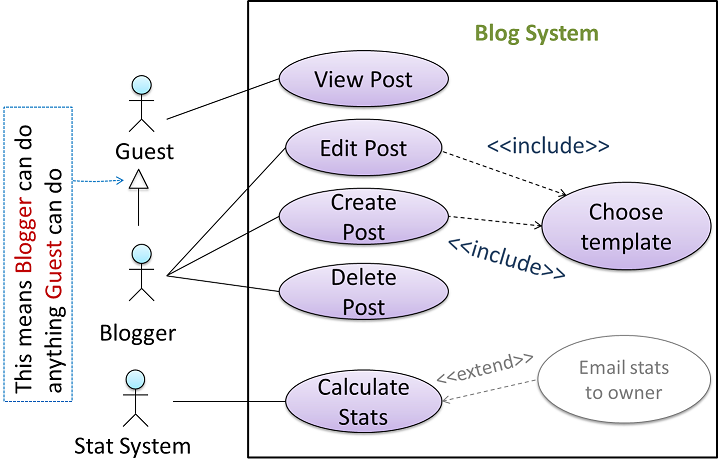

### Deployment diagram

A deployment diagram shows a system's physical layout, revealing which pieces of software run on which pieces of hardware.

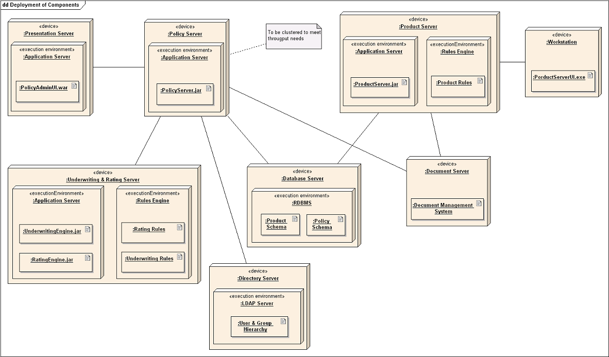

### Component diagram

A component diagram is used to show how a system is divided into components and how they are connected to each other through interfaces.

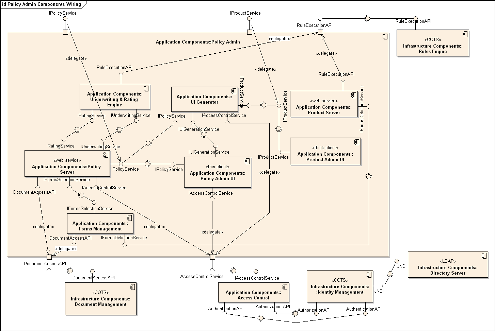

### Package diagram

A package diagram shows packages and their dependencies

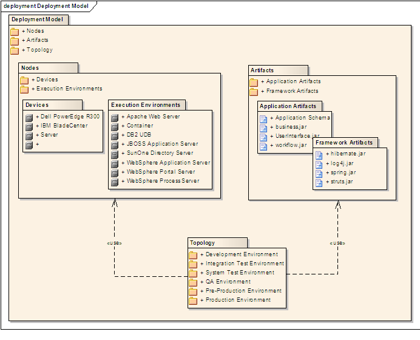

### Composite structure diagram

A composite structure diagram hierarchically decomposes a class into its internal structure.

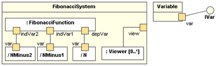

### Timing diagram

A timing diagram focus on timing constraints.

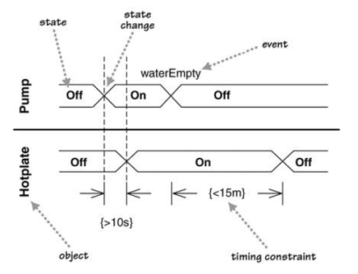

### Interaction overview diagram

An interaction overview diagram is a combination of activity diagrams and sequence diagrams.

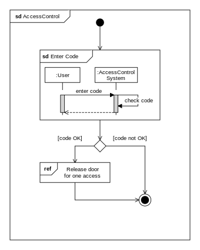

### Communication diagram

A communication diagram are like sequence diagrams but emphasize the data links between the various participants in the interaction rather than the sequence of interactions.

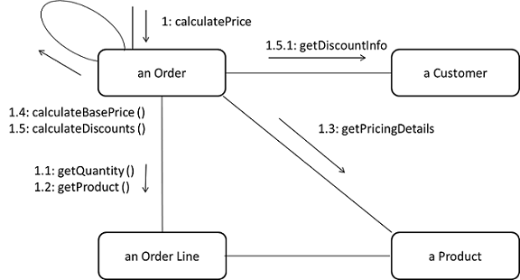

### State machine diagram

A state machine diagram models state-dependent behavior.

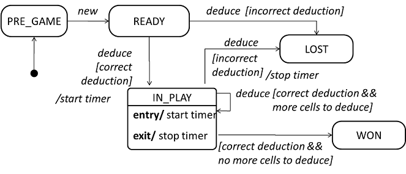

### UML notes

- UML notes can augment UML diagrams with additional information.
- A constraint can be given inside a note, within curly braces.

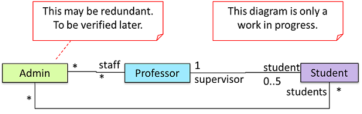

## Software engineering principle

The five principles below are collectively known as **_SOLID_**:

- Single responsibility principle (SRP): a class should have one, and only one, reason to change.
- Open-closed principle (OCP): a module should be open for extension but closed for modification.
- Liskov substitution principle (LSP): derived classes must be substitutable for their base classes.
- Interface segregation principle (ISP): no client should be forced to depend on methods it does not use.
- Dependency Inversion Principle: high-level modules should not depend on low-level modules. Both should depend on abstractions; abstractions should not depend on details. Details should depend on abstractions.

Some other principles:

- Separation of concerns principle (SoC): to achieve better modularity, separate the code into distinct sections, such that each section addresses a separate concern.
- Law of Demeter (LoD): An object should have limited knowledge of another object and only interact with objects that are closely related to it.
- Brooks' Law: Adding people to a late project will make it later.
- YAGNI (You Aren't Gonna Need It!) principle: do not add code simply because '_you might need it in the future_'.
- DRY (Don't repeat yourself) principle: every piece of knowledge must have a single, unambiguous, authoritative representation within a system.
